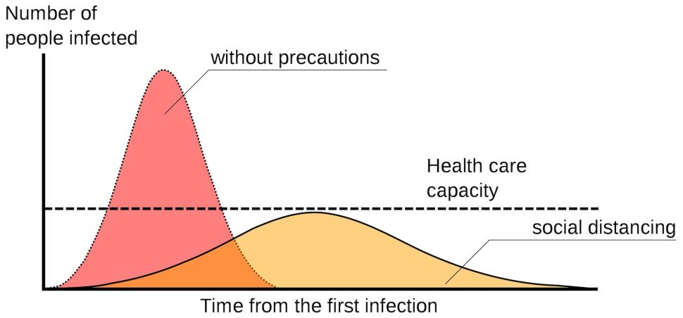

```{r setup, include=FALSE,purl=F ,echo=F, results="hide"}
library(knitr)
knit_hooks$set(purl = hook_purl)
opts_template$set(nopurl = list(purl=FALSE))
knitr::opts_chunk$set(echo = TRUE, cache=T, message=F, warning=F, fig.width=4, fig.height=3)
options(knitr.duplicate.label = 'allow')


```
# Learning Outcomes
1. students should be able to demonstrate an understanding of: 
    * mean
    * median 
    * mode
    * variance
    * standard deviation
    * Normal distribution

# Goals of the presentation
2. Demonstrate concepts using the [Labour Force Survey](https://www.statcan.gc.ca/eng/survey/household/3701)

3. R code provided is meant to:
    * reinforce previous familiarity with R
    * demonstrate concepts


# Central Tendency
- One of the goals is to describe the world with numbers.
- describing where the centre of a set of data is is pretty useful

# Mean
- most common measure of central tendency

$\overline{x}=\frac{\sum_{i=1}^{N}x_{i}}{N}$

# Mean
## Example
Load data from the Labour Force Survey

- These data are stored in a file-format called `sav` which is really common in the social sciences
- loading the `haven` library provides the `read_sav()` command to read it in
- loading the `labelled` library lets us search through variables quickly

# Mean
## Example
```{r load-data}
#install.packages(c('haven', 'labelled'))
library(haven)
lfs<-read_sav('https://github.com/sjkiss/DMJN328/raw/master/Lecture_Notes/mar_11/data/lfs.sav')
```
```{r search-variables}
library(labelled)
look_for(lfs, "wages")

```

# Mean
## Example
```{r look-for-education}
look_for(lfs, "education")

```

# Mean
## Example
```{r look-for-sex}
look_for(lfs, "sex")
```

# Mean
## Example

```{r visualize-wages}
library(tidyverse)
lfs %>%
  ggplot(., aes(x=HRLYEARN))+geom_histogram()
```

# Mean
## Calculate mean
```{r calculate-mean}
mean(lfs$HRLYEARN, na.rm=T)
```

# Mean
## Means by group
```{r mean-by-group}
lfs %>%
ggplot(., aes(x=HRLYEARN))+geom_histogram()+facet_wrap(~as_factor(SEX))

```

# Mean
## Means by group
```{r show-means-by-sex}
lfs %>%
group_by(SEX) %>%
summarize(avg=mean(HRLYEARN, na.rm=T))
```

# Median
- means are vulnerable to outliers
```{r show-influence-of-outliers}
vector1<-c(1,2,3,4,5,6,7,8,9,10)
mean(vector1)
vector2<-c(1,2,3,4,5,6,7,8,9,10, 1000000)
mean(vector2)
```


# Median
- Median is a different measure of central tendency
- The value at which half of a variable is above, half is below.

```{r show-median-of-hourly-wages}
lfs %>%
  group_by(SEX) %>%
  summarize(median=median(HRLYEARN, na.rm=T))
```

# Median
- median is immune to outliers
```{r show-media-vectors}
median(vector1)
median(vector2)
```

# Mode
- Mode is the most frequently occurring variable in the data
- useful for categorical data

```{r quietly-show-educational-attainment, purl=F, echo=F}
#Note the knitr library just provides the kable() command which formats the table nicely
library(knitr)
kable(table(as_factor(lfs$EDUC)))
```

```{r show-educational-attainment, results="hide", echo=F}
table(as_factor(lfs$EDUC))
```

# Mode
- Not usually measured for numeric data

# Measures of Dispersion
## Variance
- Often not just interested in the center of the data, but the distribution
```{r show-same-means-different-variancee}
#make one class of fake data, average =75, standard deviation =1
class1<-rnorm(100, mean=75, sd=1)
#make a second class of fake data, average-=75, standard deviation = 10
class2<-rnorm(100, mean=75, sd=10)
#combine into a dataframe
df<-data.frame(class1, class2)


```

# Measures of Dispersion
## Variance
```{r graph-different-variances}
df %>%
  #gather into Class and Grade
  gather(Class, Grade) %>%
  #Graph and facet
  ggplot(., aes(x=Grade))+geom_histogram()+facet_wrap(~Class)
```

# Measures of Dispersion
- different spreads have very different real-life consequences

```{r include-flatten-thecurve, purl=F, echo=F, eval=T}

```

# Measures of Dispersion
## Variance
1. Subtract the average from each value
2. Square it to get rid of the negatives
3. Sum everything up
4. divide by the sample size.

# Measures of Dispersion
## Variance
$$
s^2 = \textrm{sample variance}\\
\sum = \textrm{sum everything from the bottom to the top}\\
\overline{x} = \textrm{sample average}\\
N = \textrm{sample size}\\
$$

$$s^2=\frac{\sum\limits_{i=1}^N{(x_i-\overline{x})}^2}{N-1}$$

# Variance

```{r calculate-variance}
#Step 1 is to subtract hte average from each value
step1<-lfs$HRLYEARN-mean(lfs$HRLYEARN, na.rm=T)
#step 2 is to square to get rid of the means
step2<-step1^2
#step 3 is to sum all of the variances, na.rm=T to remove missing values
step3<-sum(step2, na.rm=T)
#step 4 is to divide by the sample size (excluding missing values)
variance<-step3/(length(na.omit(lfs$HRLYEARN))-1)
#compare with the base
print(variance)
var(lfs$HRLYEARN, na.rm=T)

```

# Standard Deviation
- variance is expressed in units squared
- unsquare it gives us a standard deviation

$$s=\sqrt{\frac{\sum\limits_{i=1}^N{(x_i-\overline{x})}^2}{N-1}}$$


- Commonly we talk about something being 1 standard deviation away, or two standard deviations away.
- Standard deviation is a number that describes the averge distance from the average in the units that variable is taken.

# Distributions
- Data come in different types (categorical, numeric)
- there are different processes in the universe that generate data
- data follow different distributions
    * Recall from ** The Joy of Stats** the importance of a distribution

# Distributions
1. Normal distribution
    - mean = median = mode
    - contstantly reoccurring pattern in nature

# Distributions
1. Normal distribution

```{r show-normal}
#use rnorm to generate 10000 random numbers according to the normal distribution
#mean of 1000 and standard deviation of 500
var1<-rnorm(10000, mean=1000, sd=500)
#make into a data frame
df<-data.frame(var1)
#graph a histogram
ggplot(df, aes(x=var1))+geom_histogram()+theme_bw()+labs(title="Randomly Generated Normal Distribution")
### Go back upand play with the mean and sd.

```

# Distributions
2. Uniform Distribution
    - numbers on a die

# Distributions
2. Uniform Distribution
```{r show-uniform}
#Sample a number from 1 to 6 (like on a die roll), 10000 times
var1<-sample(1:6, 10000, replace=T)
#turn into a dataframe (die)
die<-data.frame(var1)
#Graph as a
ggplot(die, aes(x=var1))+
  #as a barplot, counting the numbr of times each number occurs
  geom_bar(stat="count")+
  #turn it black and white
  theme_bw()+
  #give some labels
  labs(title="Distribution of numbers on a fair die", x="Number")


```

# Distributions
Normal Distribution

```{r show-mean-median}
mean(df$var1, na.rm=T)
median(df$var1, na.rm=T)
```

# Normal Distribution
- an absolute key feature of the normal distribution is that approximately:
    - 68\% of all cases lie within one standard deviation of the mean;
    - 95\% of cases lie within two standard deviations of the mean and
    - 99\% of cases lie within three standard deviations from the mean.

# Normal Distribution
```{r show-normal-distribution, purl=F,include=T, out.width="50%", echo=F, opts.label="nopurl"}
knitr::include_graphics("images/Empirical_Rule.png")
```


