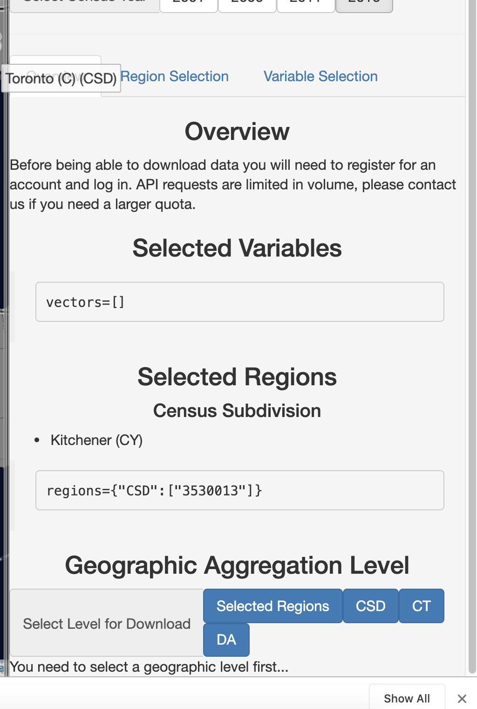
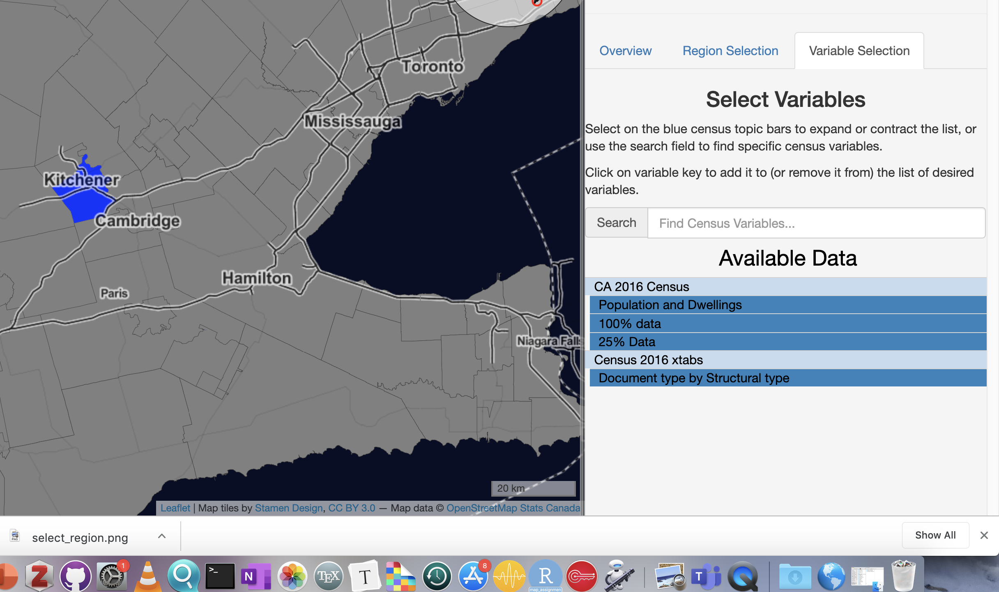
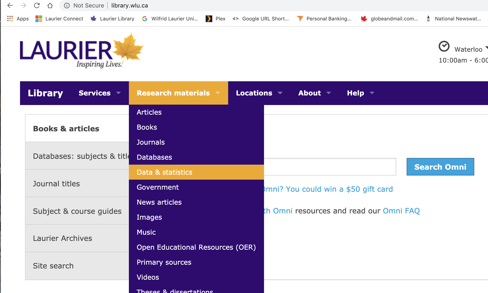
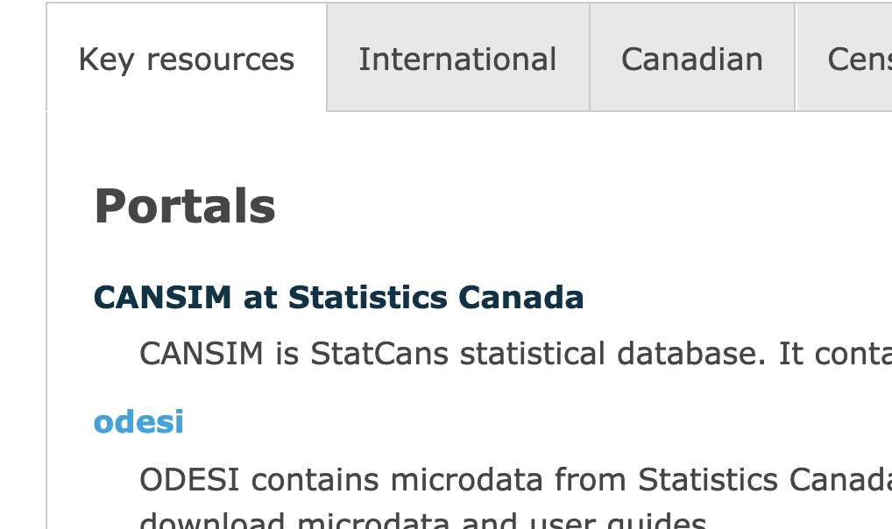
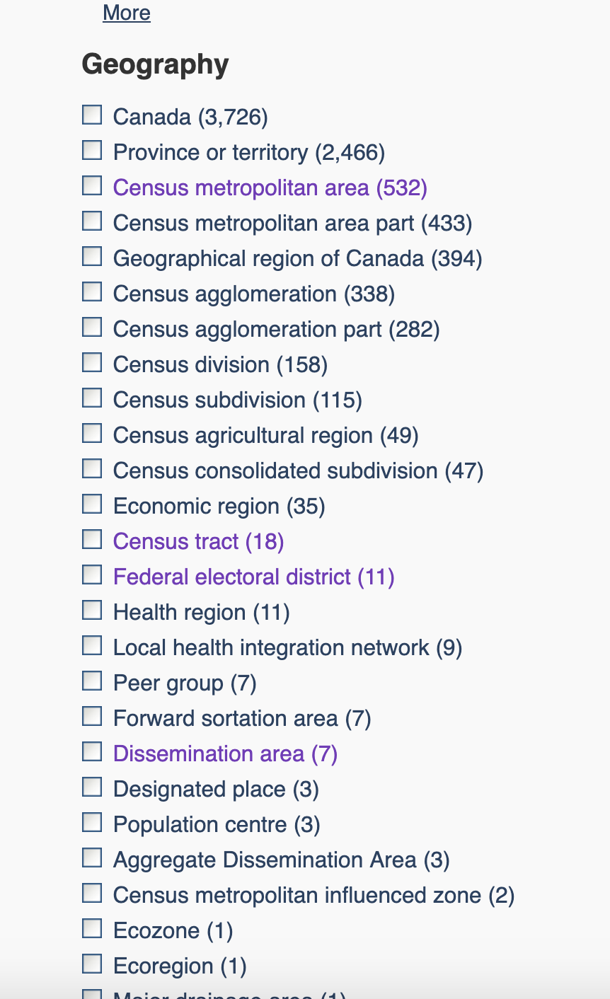

```{r setup, include=FALSE}
library(knitr)
knitr::opts_chunk$set(echo = TRUE, results='markup', out.width="75%", eval=T, message=F, warning=F, fig.width=3, fig.height=3, fig.align='center', include=T, dpi=150)
```


# Understanding The Hierarchical Nature of Statistics Canada Data
As I mentioned in class the other data, Statistics CAnada has a systematic - but complex - way of categorizing its data based on geographic areas. It is hierarchical in nature, so data is aggregated into a variety of levels. 

One way is:

1. (PR) Province

2. (CD) Census District (or Division, I've seen both)

> "Group of neighbouring municipalities joined together for the purposes of regional planning and managing common services (such as police or ambulance services). These groupings are established under laws in effect in certain provinces of Canada. Census division (CD) is the general term for provincially legislated areas (such as county, municipalité régionale de comté and regional district) or their equivalents."
`r tufte::quote_footer('--- [Statistics Canada](https://www12.statcan.gc.ca/census-recensement/2016/ref/dict/geo008-eng.cfm)')`

3. Census Subdivision (CSD)

4. Census Tracts (CSD)

> "Area that is small and relatively stable. Census tracts usually have a population between 2,500 and 8,000 persons. They are located in census metropolitan areas and in census agglomerations that have a core population of 50,000 or more."
`r tufte::quote_footer('--- [Statistics Canada](https://www12.statcan.gc.ca/census-recensement/2011/ref/dict/geo013-eng.cfm)')`

5. Dissemination Areas (DA)

> "A dissemination area (DA) is a small, relatively stable geographic unit composed of one or more adjacent dissemination blocks. It is the smallest standard geographic area for which all census data are disseminated. DAs cover all the territory of Canada."
`r tufte::quote_footer('--- [Statistics Canada](https://www150.statcan.gc.ca/n1/pub/92-195-x/2011001/geo/da-ad/def-eng.htm)')`

In addition, there are other categories that reflect a parallel hierarchy. Probably the most important of these are: Census Metropolitan Areas and Census Agglomerations.

> "Area consisting of one or more neighbouring municipalities situated around a core. A census metropolitan area must have a total population of at least 100,000 of which 50,000 or more live in the core. A census agglomeration must have a core population of at least 10,000."
`r tufte::quote_footer('--- [Statistics Canada](https://www12.statcan.gc.ca/census-recensement/2011/ref/dict/geo009-eng.cfm)')`


# Geographic Files and Data Files
As well, the other thing to keep in mind is that we need to get geography files, usually `.shp` file extension, that contain information about each boundary and an identifier. When you look at `.shp` files, you'll see that each subdivision in the file that you download will have also has variables that identify which geographic area (Census Tract, Census Subdivision, Census Division) that the boundary belongs to.

This allows for merging to add data to geography files.

*Data files* can come from anywhere, but the `cancensus` r package makes it very easy to get both the geography and the data file at once. However, you are welcome to take data file from anywhere. The key thing to remember is that the data you get must somehow have geography identifiers that match up with the geography file that you have downloaded.

# Getting a folder for your map assignment

As with everything in this course, it is very useful to set up a folder with an RStudio project folder specifically for your map assignment. I have already actually created one on the course GitHub page. If you are able to to pull changes from the DMJN328 course page in GitHub, by following the instructions [here](https://github.com/sjkiss/DMJN328/raw/master/Using_github/syncing_to_course_repository.pdf), then you should see a folder called "map assignment" in your course folder (see Figure \@ref(fig:map)).


```{r map, echo=F, include=T,fig.cap="The map assignemnt folder."}

knitr::include_graphics("images/map_assignment.png", dpi=150)

```


Open the .Rproj file with RStudio.

If not, make your own folder in the course folder, call it whatever you want and make an RStudio Project file in that folder.

# Using Census Mapper

[Census Mapper](http://www.censusmapper.ca) is an open source project that makes it easier to access Statistics Canada's vast troves of census data and link it to geographical files for Canada to make it easier to visualize Canadian census data. It is meant to work seamlessly with R.

## Installing the package and loading the library

As with everything, we need to install packages and load them.

Open an R Script (or you can open the pre-made cancensus_tutorial.R script that is in the `map assignment` folder)

You can start with these commands to install census mapper and load the library.

Note, any code snippets that appear in this document are formatted so that you should be able to copy and paste them into an R script.

```{r, eval=F, echo=T}
install.packages('cancensus')
library(cancensus)
```

## Getting an API
While it is free and open source, it is necessary to register for an API. Click on the top-right of the website to login and get an API (see Figure \@ref(fig:api)).

```{r api, fig.cap="Getting an API", echo=F}
include_graphics("images/get_api.png")
```


The API should look something like this (see Figure \@ref(fig:api2)).

```{r api2, fig.cap="What an API looks like.", echo=F}
include_graphics("images/api.png")
```


## Using your API in R

There are two ways to use your API: temporary and permanent.

### Temporary
The temporary way is to insert the following command at the top of any script you write that interacts with census mapper. **Of course, you need to insert your own API key after the `=` sign.** The one below is a modified version of my own, so it won't work.


```{r set-options}
options(cancensus.api_key='CensusMapper_287500bb91a374ec69fdcf27')
```

After that, any commands you run in that script will interact with Census Mapper nicely.

The downside to the temporary approach is: 1) you need to do it every time you write a script to get data or files from Census Mapper and 2) if you share your code with anyone then you will expose your API. It's not a big deal, but it's something.

### Permanent
The permanent approach sets your cancensus API inside R permanently, or as long as you have this computer.
The way you do it is to open an invisible file called `.Rprofile` on your computer and insert the options command in there.

The following command opens `.Rprofile` (or makes it if it does not already exist).

```{r rprofile, results="asis", eval=F}
file.edit(file.path('~/.Rprofile'))
```

Figure \@ref(fig:r-profile-image) is what mine looks like.
Lines 1:3 are just notes for myself, line 4 is a little command that I use frequently and lines 5 and 6 are my cancensus options.

```{r r-profile-image, echo=F, fig.cap="Simon's .Rprofile file, as an example"}
include_graphics("images/rprofile.png")
```


So, in your `.Rprofile` file, just plunk the `options()` command with your api key, just like this and save it the file.

```{r api-2}
options(cancensus.api_key='CensusMapper_287500bb91a374ec69fdcf270fb2')
```

### CensusMapper Cache

As you can imagine, downloading geographic files and Statistis Canada data can involve quite a lot of data. This can: a) take a long time and b) overload CensusMapper and Statistics Canada. To minimize the burden on everyone, it is recommended (but not necessary) to also set a *cache* for census mapper data.

A cache is just like a food cache; a place to store something you might need in the future.

So, in this case, you set a cancensus cache as directory on your computer. When you download data from cancensus once, then it will be stored there; if you need to run your script again, the cancensus package will *first* look in the cache to see if it is there, allowing you to not go through the hassle of downloading the information from the internet again.

This step is *optional* but, for obvious reasons, recommended and will probably make your life easier.

You set the cache directory the exact same way as setting the API.

Note that you get to choose where you want to put your cache. I find it pretty unobtrusive just to put it in your root user directory, but it's up to you.

To set it *temporarily*, enter this command at the top of your script. Note the `~` is Mac-speak for the user's home directory. This *should* work on a PC, but it might not. You *might* need to play with this a little bit, if you have a PC.

```{r set-cache-path}
options(cancensus.cancensus.cache_path="~")
```

To set it *permanently*, enter the same command in your `.rprofile` folder, following the steps above, save and restart.

*If you have gone the permanent route and modified your .Rprofile file, you need to restart RStudio for the changes to take effect*


## Getting the data out of Census Mapper.
Now we can go over to [](http://censusmapper.ca) to get our geography and data files.

Remember that to make our map, we need both some geography files and some data to visualize.

### Geography

To select the geographic area you want to work with, play with the cursor to zoom to a region you are interested in.

If you click on "Region Selection" you can zoom quickly to different levels of geography, e.g. Province, census division, census sub-division, census metropolitan area, whatever. I find this convenient.

When you have a geographic boundary area that you are interested in playing with, select it and it should turn *blue*. If you click the same area again, it should deselct the region.  Figure \@ref(fig:select-ontario) is what it looks like if you have selected Ontario.

```{r select-ontario, echo=F, fig.cap="Selecting an area."}
include_graphics("images/selecting_ontario.png")
```


Please note: when you select a geographic region, you will still be able to get the boundary files and data from *sub-units*. So, in the image, I have selected Ontario, but at the next step, I will be able to get data and boundaries on sub-units (e.g. census sub-divisions for all of Ontario, or even all the census tracts). Here, I have just excluded other provinces.

So this is a choice you get to make. One thing to keep in mind, the larger the geographic unit that you select, the more data you will be downloading.

I am going to select Kitchener, so I'm going to zoom in on the Census Metropolitan Area level, drag the map to about the KW area and select Kitchener (see Figure \@ref(fig:select-kitchener)).

```{r select-kitchener, echo=F, fig.cap="Selecting Kitchener"}
include_graphics("images/select_kitchener.png")
```


Note that I had to select "Clear Selection" first to deselect Ontario, and then select "Kitchener".

If I jump over to "Overview" I'm going to get a screen that looks like Figure (\@ref(fig:overview) (below). There's some useful information here.

```{r overview, fig.cap="Looking at the overview", echo=F}

```


Notice under "Selected Variables" it says `vectors=[]`.  That is because we have not yet selected any data to download.

And under "Selected Regions", it says that we have selected Kitchener (CY) and that `regions={"CSD":["3530013"]}. The `regions` stuff is code for Census Subdivision (CSD) 3530013.

The more you play with Statistics Canada's data, the more you will learn how it works, but basically, the CSD code is made of a province code (Ontario  = 35), a two-digit Census Division code (Waterloo Region = 30) and a 3-digit Census Sub-division code (City of Kitchener = 013).

So, Statistics Canada has a very systematic way of coding Canada's geography. Kitchener is always through all of StatsCan's data coded as 35300013.

Under Geographic Aggregation Level, there isn't really anything selected. Here, we can select what level of data we want to visualize and what boundaries we want to draw. Because we have only selected the City of Kitchener (which is a Census Sub-Division) there are only three options that we can download:

1. CSD (Census Subdivision) which will download the outer boundaries of the CSD Kitchener
2. CT  (Census Tracts) which are about maybe ward-level boundaries inside the City of Ktichener
3. DA (Dissemination Areas) which are almost block-level boundaries inside Kitchener.

Obviously option 3 will give us the most fine-grained view of the City of Kitchener, but you might not get as much data.

I raised this in class the ohter day, but in looking at it, I see that there actually is quite a lot of data. So, let's do it.

Let's select DA (see Figure \@ref(fig:select-dissemnination-area)).

```{r select-dissemnination-area,fig.cap="Selecting Dissemination Areas", echo=F}
include_graphics("images/selecting_dissemination_areas.png")
```


Then go back to overview. If you look at the bottom, there is some R code there and it should look just like this.

```{r r-code, eval=F, tidy=T}
census_data <- get_census(dataset='CA16', regions=list(CSD="3530013"), 
                          vectors=c(), labels="detailed", geo_format=NA, level='DA')
```

I am going to modify it slightly and comment it so we know what is going on.


```{r eval=T, results="hide", echo=F }
source('~/.Rprofile')
library(cancensus)
```


```{r get-kitchener-data, eval=T, echo=T,tidy=T, results="hide"}
#Instead of saving it as census_data, I am saving it as kitchener, for ease of memory.
#dataset=CA16 says get data or boundary files from the 2016 Census
kitchener<- get_census(dataset='CA16',
regions=list(CSD="3530013"), vectors=c(), labels="detailed",
geo_format="sf", level='DA')
```

This should leave us with an object called `kitchener` in our environment.

Try this command. Note: loading the `tidyverse` library is necessary to run commands like `glimpse()`, `gather()` and `ggplot()`.

```{r glimpse-kitchener, eval=T, results="markup", echo=T}
library(tidyverse)
glimpse(kitchener)
```

So there you have it: the dissemination area boundary files for the city of Kitchener. There are 314 observations (rows) of 11 variables. We can go through them one-by-one beause it is quite informative.

1. `Shape Area` - I *think* this is the size of each dissemination area.
2. `Type` - is a factor (fct), and it just says that each row is a dissemination area (DA)
3. `Dwellings` - integer (int) variable that says how many dwellings are in each DA
4. `Households` - integer (int) variable that says how many households are in each. I don't quite understand the difference; one would have to read some documentation at Statistis Caanda.
5. GEOUID - character (so not a number) . From the looks of this, this looks like it is the unique identifier for each dissemination Area (more [here](https://www150.statcan.gc.ca/n1/pub/92f0138m/92f0138m2019001-eng.htm))
6. Population - Integer (int) variable showing the population of each DA
7. CD_UID - variable showing the census district identifier `35` for Ontario and `30` for the Census District of Region of Waterloo
8. CSD_UID - variable showig the Census sub-division identifier:`35` for Ontario and `30` for the Census District of Region of Waterloo, and `013` for the CSD of Kitchener
9. CT_UID - variable showing the Census Tract identifier for the CT that each DA is in.
10.CMA_UID - variable showing the ID for the CMA (Census Metropolitan Area) that each DA is in. Kitchener-Waterloo-Cambridge is the CMA 35541 (`35` for Ontario and `541` ) for all of K-W-C.
11. geometry - there it; those are the geometry coordinates for each of the DAs.


## Drawing the map

Now it should be dead easy to draw the map, because it's *exactly the way it works in the lesson*.

```{r eval=T, echo=T, include=T}
library(ggplot2)
ggplot(kitchener, aes(geometry=geometry))+geom_sf()
```

When you download the boundary files for a region, it looks like you get basic population data. So with just this command, we could fill in each DA with the population #s exactly the way that we did with the boston data in the exercises.

```{r eval=T, include=T}
ggplot(kitchener, aes(geometry=geometry, fill=Population))+geom_sf()
```

I'm going to stop there, because we've practiced different ways of gussying up the map in the exercises, and it's pretty easy.

The next section talks about how to add different variables, other than population via `cancensus`


## Data

go back to the web browser and click on "Variable Selection" Honestly, this product is so incredible it kind of makes your head spin (see \@ref(fig:kitchener-variables)). Bear with me.

```{r kitchener-variables, fig.cap="Selecting variables to map on Kitchener"}


```


Note that there are two categories at the top: `100% Data` and `25% Data`. The difference between the two is that the first is the results from *every single household and person that filled out the census* and the second is the results of sample drawn from the full census (25% of the results). So, it is a *huge* sample and extremely accurate, but it is still just a *sample*.

Some variables are only released with sample data, basically out of privacy concerns (I think).

You can search by keyword, or browse through by topics.

There are a few things to really note:

1. Each variable appears to be summarized by sex. That is, if you want, you can track the results of each variable in the sense for men, women or total (if you do not care to differentiate by sex.)

2. Each variable has a code attached to it that starts with a `v`. e.g. The `Total age` variable is `V_CA16_1`. `V` stands for `vector`, `CA16` is the 2016 Census and `1` is just the identifier of the individual vector.

A vector is a string of numbers that represents the variable in question.

Now, we're not going to get that vector, because it will only tell us the Total number of people who provided Age data to the census.

But if you click on it and you'll see that it expands into more categories, with more vectors. Now, there is a female 0 to 14 years vector, a male 0 to 14 years vector and a total 0 to 14 years vector.

So those three vectors will provide us with the number of females, males and total (both sexes) 0 to 14 years old in each dissemination area in Kitchener.

You can click on the 0 to 14 years vector as well and you see that you get finer-grained vectors. Now you have the number of 0 to 4 year olds, 5 to 9 year olds etc, for males and females and total (both sexes.)

Click on 0 to 4 one more time and you see you get right down to the one year category. Note: not all variables in the census will have vectors with this level of detail.

For now, let's just select the vector that has the total number of 0 to 4 year olds. This will tell us where the toddlers live in Kitchener.  Clicking on a vector selects it, and it should appear in the text box above the list of vectors. Clicking on it again, deselcts and clear i

Go back to the `Overview` screen and you'll see R code again. It should look like this.


```{r dummy-variable-data, eval=F, tidy=T}
census_data <- get_census(dataset='CA16', regions=list(CSD="3530013"), 
                          vectors=c("v_CA16_4"), labels="detailed", geo_format=NA, level='DA')

```

Notice that this is exactly the same code as above; the only difference is that the `vectors` argument actually has something in it; namely `v_CA16_`, which is the total age vector.

I'm going to modify the code a little bit. We'll call the new dataframe `kitchener2` and remember you have to specify which geographical file format you want.

```{r modify-variable-code, eval=T,results="hide", tidy=T}
kitchener2 <- get_census(dataset='CA16', regions=list(CSD="3530013"), vectors=c("v_CA16_4"), labels="detailed", geo_format="sf", level='DA')

```
Now we glimpse the data again to take a look.

```{r glimpse-toddlers,echo=T,eval=T, results="markup"}
glimpse(kitchener2)
```

Now, we have something that looks like the same dataset, but it has 14, rather than 11 variables. And the 14th variable `v_CA16_4: 0 to 14 years` is the one that we really want. It's a `dbl` variable, which is a fancy, overly complicated way of saying that it's a number tnat can have decimal numbers.

Now we could map out where the toddlers in Kitchener live. But before we do that, we might want to rename that ugly variable name.

We have practiced using the `rename()` command. There are two ways to use it, oen without pipes one with. Both of these below are equivalent.

```{r rename, eval=T, results="markup", echo=T}
#Check the original names
names(kitchener2)
```

```{r rename-methods, eval=T, results="asis", echo=T}
#Option 1
kitchener3<-rename(kitchener2, "Toddlers"=`v_CA16_4: 0 to 14 years`)

#Option 2 with pipes
kitchener3<-kitchener2 %>%
  rename("Toddlers"=`v_CA16_4: 0 to 14 years`)

#Option 2a with pipes
### This is my favourite way because it is so logical
### The saving part comes at the end
kitchener2 %>%
  rename("Toddlers"=`v_CA16_4: 0 to 14 years`)->kitchener3

```
```{r recheck-names, results="markup", echo=T, eval=T}
#Check the new names
names(kitchener3)
```

Then we can draw the map showing the number of toddlers in each dissemination area.

```{r toddler-map, include=T, echo=T, eval=T}
ggplot(kitchener3, aes(geometry=geometry, fill=Toddlers))+geom_sf()
```

Now, note that these are *raw* numbers. If you wanted to show the percent of the population to control for how many people live in each dissemination area, we would have to make a percentage variable.  That is pretty easy and we have done it before in the dataset on whales earlier in the online exercises.

```{r check-names, echo=T, results="markup"}
#check the names
names(kitchener3)
```

Because we already have the Population variable, we can just divide the number of Toddlers by the population and then we will get a percentage of the total population and multiply by 100

We use the `mutate()` command to make a new variable. The following two ways are *equivalent*

```{r make-percent, eval=T, echo=T, results="hide"}
#Option 1 without pipes
kitchener4<-mutate(kitchener3, percent=(Toddlers/Population)*100)
#option 2 with pipes
kitchener4<-kitchener3 %>%
  mutate(percent=(Toddlers/Population*100))
#option 2a with pipes
kitchener3 %>%
  mutate(percent=(Toddlers/Population)*100)->kitchener4
```

Then we can redraw using the exact same code. Note that our `fill` variable is different now though, because we are not filling based on the number of Toddlers, but the percent variable that we created above.

```{r plot-percent, eval=T, include=T}
ggplot(kitchener4, aes(geometry=geometry, fill=percent))+geom_sf()
```


## How do we add in a third variable.

Let's just say that we want to break out the toddlers by sex.  It's important to remember: Statistics Canada is not providing us with the individual level data from the census. They are aggregating it for us. What this means is that we cannot do a lot of crosstabulations by different variables.

For example, we could not show the distribution of toddlers of different ethnicities, for example unless Statistics Canada provides us with a table that has those two variables already combined.

The only variable that is almost always crosstabbed is sex. So we can always go back to the 0 to 4 years category and select the female and the male vectors.

The R code looks like this. Note this is the exact code to download the Kitchener data as above. I've just changed the vector numbers and saved this in `kitchener5`

```{r, eval=T, results="hide", echo=T, tidy=T}
kitchener5 <- get_census(dataset='CA16', regions=list(CSD="3530013"), vectors=c("v_CA16_9","v_CA16_8"),
labels="detailed", geo_format="sf", level='DA')
```
Note, how we're getting two new vectors.

```{r toddlers-sex, echo=T, results="markup", eval=T}
glimpse(kitchener5)
```
Those variable names are ugly so we should rename them again. If we go back to the website, we know that vector `v_CA16_9` is females and vector `v_CA16_8` is males.

And remember, we can use the `rename` command based on position as well as by name. This would work on the `rename()`commands above, as well, you just need to identify what the variable names are that you need to rename.

```{r check-names-kitchener-5, eval=T, results="markup", echo=T}
#check names
names(kitchener5)
```

We are going to change the names of variables 14 and 15.
```{r echo=T, eval=T, results="markup"}
#option 1
kitchener6<-rename(kitchener5, Females=14,Males=15 )

#option 2 with pipes
kitchener6<-kitchener5 %>%
  rename(Females=14, Males=15)

#option 2a
kitchener5 %>%
  rename(Females=14, Males=15)-> kitchener6
```
```{r}
#rechecknames
names(kitchener6)
```


Now the othe problem is that this is not tidy data. There are two different y-variables (`Females` and `Males`.)

Using the `gather()` command, we say what is the new `key` variable going to be called (i.e. `Sex`, the new value variable `n` and which variables get gathered).

```{r gather-kitchener, eval=T, echo=T}
#option 1
kitchener7<-gather(kitchener6, Sex, n, Females, Males)

#Optino 2
# you can do it with pipes.
kitchener7<-kitchener6 %>%
  gather(Sex, n, Females, Males)

#option2a
kitchener6 %>%
  gather(Sex, n, Females, Males)-> kitchener7
```


```{r glimpse-kitchener-again, eval=T,results="markup", echo=T}
glimpse(kitchener7)
```

Now we could draw the map and facet on sex. Note now we have named the variable that has the actual number of toddlers to be `n`.

```{r facet, echo=T, eval=T}
ggplot(kitchener7, aes(geometry=geometry, fill=n))+
  geom_sf()+
  facet_wrap(~Sex)
```
## Colours
It's pretty easy to change colours on maps. One way is to use the function `scale_fill_gradient()` to your graph. It takes a `low` and a `high` argument that are R colours. You can find a full list of R colours [here](http://www.stat.columbia.edu/~tzheng/files/Rcolor.pdf). here are two examples.

```{r scale-fill-radient, echo=T, eval=T}
ggplot(kitchener7, aes(geometry=geometry, fill=n))+
  geom_sf()+
  facet_wrap(~Sex)+scale_fill_gradient(low="firebrick1", high="firebrick4")

ggplot(kitchener7, aes(geometry=geometry, fill=n))+
  geom_sf()+
  facet_wrap(~Sex)+scale_fill_gradient(low="darkblue", high="lightgreen")

```

Another way to do it is to use the command `scale_fill_distiller()`. It uses a really neat website [(http://colorbrewer2.org)](http://colorbrewer2.org) that is built to provide pre-built color palettes for maps.

It's useful to look at the help page for it:

```{r help-distiller, results="hide", echo=T, eval=F}
?scale_fill_distiller()
```

There you'll read that that there are three different tyupes of colour palettes:
1. sequential, that goes from a low to a high value
2. diverging, that goes from a medium value to a high and a low value in opposite directions
3. qualitative that doesn't use a gradient, but selects categorically different colours for different levels of the data in yoru maps.

If you read further down in the help documentation you'll see the pre-built palettes that are provided.

For example:

```{r show-palettes}
ggplot(kitchener7, aes(geometry=geometry, fill=n))+
  geom_sf()+
  facet_wrap(~Sex)+scale_fill_distiller(palette="Spectral")
```

Or:

```{r show-palettes-oranges}
ggplot(kitchener7, aes(geometry=geometry, fill=n))+
  geom_sf()+
  facet_wrap(~Sex)+scale_fill_distiller(palette="Oranges")
```

Remember, in the online course, Andrew Ba Tran had us fiddle with the direction argument. By setting the `direction=1` you make the dark colours correspond to high values, which is more intuitive. It's a useful thing to use.


```{r show-palettes-directions}
ggplot(kitchener7, aes(geometry=geometry, fill=n))+
  geom_sf()+
  facet_wrap(~Sex)+scale_fill_distiller(palette="Oranges", direction=1)
```
## Other Sources of Geographical Data

The census is not the only source of data out there, not by a long shot. Statistics Canada does a lot of other surveys, some of the students have encountered these. The major issue with those is that Statistics Canada does not publish results down to the very narrow geographical areas that we played with above.

A way to search for some of these is to go to Statistids Canada'as Cansim website, through the Laurier library (see Figure \@ref(fig:cansim)).

```{r cansim, echo=F, fig.cap="Finding Cansim"}

```

From there, select "Cansim" (See Figure \@ref(fig:cansim2) )

```{r cansim2, echo=F, fig.cap="Finding Cansim"}

```

If you look on the left, you can filter the vasta array of cansim datasets by geography (see Figure  \@ref(fig:geography)) . The number on the right of each category refers to the number of data products available for each geographical level. So there are over 2,000 tables at the provincial level, 532 at the Census Metropolitan Level, 158 at the Census Division level (e.g. regional municipalities), 115 at the Census Subdivision level only 18 that publish data at the census tract level and only 7 at the dissemination level.

```{r geography, echo=F, fig.cap="Statistics Canada's Geographical Data sets"}

```

So, this route presents a couple of options:First, you can just browse the different tables at different geographical levels to find something interesting. Then you can get the boundary files (without vectors of variables!!) from Census Mapper and then combine them.

### A note on Federal Electoral Districts

Federal Electoral District boundary files are not available through Census Mapper. However, they (and all the census boundary files) are available [here](https://www12.statcan.gc.ca/census-recensement/2011/geo/bound-limit/bound-limit-eng.cfm). So that could be super interesting to combine those with some of the data that appears to be published by STatistics Canada above.

one way that Statistics CAnada makes things easy for people is that each FED will have a unique number associated with it that is used by Elections Canada and by Statistics Canada to facilitate merging.


